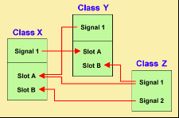

# Signals and Slots
<br>

# Introduction :
We are gradually starting to master the creation of a window. In the previous chapter, we laid a solid foundation for the further development of our application. We made a custom class, inheriting from QWidget.

We are now going to discover the mechanism of signals and slots, a principle specific to Qt which is clearly one of its strong points. This is an attractive technique for handling events within a window.
For example, if we click on a button, we would like a function to be called to react to the click. This is precisely what we will learn to do in this chapter, which will finally make our application dynamic.


<span style="color:blue">Signals  </span> and <span style="color:blue">slots  </span>  is a language construct introduced in Qt for communication between objects which makes it easy to implement the observer pattern while avoiding boilerplate code. The concept is that GUI widgets can send signals containing event information which can be received by other widgets / controls using special functions known as slots. This is similar to C/C++ function pointers, but signal/slot system ensures the type-correctness of callback arguments.

<br>



<br>

#  <span style="color:red">Signals  </span>
Signals are emitted by an object when its internal state has changed in some way that might be interesting to the object's client or owner. Signals are public access functions and can be emitted from anywhere, but we recommend to only emit them from the class that defines the signal and its subclasses.

<br>

# <span style="color:red">Slots  </span>
A slot is called when a signal connected to it is emitted. Slots are normal C++ functions and can be called normally; their only special feature is that signals can be connected to them.
<br>

<br>


<br>

<br>


In this practical course we will work on three main examples which are: 
<br>

* <span style="color:green">Calculator  </span>
* <span style="color:green">Traffic Light </span>
* <span style="color:green">Digital clock  </span>
<br>

<br>

#  Calculator 
The goal is to use Signals and Slots to simulate a basic calculator behavior that support operations such as : *, +, -, /.


<br>


>The Header File (calculator.h)
```java script
class calculator:public QWidget { Q_OBJECT

public:
    calculator(QWidget *parent =nullptr);
     ~calculator();
public slots:
    void newDigit();
    void changeOperation();//slot to handle the click on operations
    void EnterButton();
    void reset();
    
   
private:
    int *left;
    int *right;
    QString *operation=nullptr;
    int *out;
    
protected:
//function to create widgets
    void createWidgets();
//function to place widgets
    void placeWidgets();
//create all the connectivity
    void makeConnexions();

//events
protected:
    void KeyPressEvent(QKeyEvent *e)override;
private:
    QVector <QPushButton*> digits;//vector for digits
    QVector <QPushButton*> 
    operations;//operation buttons
    QPushButton *enter;//enter button 
    QPushButton *reset;//reset button 
    QVBoxLayout *layout;//main layout for the button 
    QLCDNumber *disp;//where to display numbers
    QGridLayout *buttonLayout;//layout for the buttons 
    
}
```  
>The Implementation File (trafficlight.cpp)

```java script
calculator ::calculator(QWidget *parent):QWidget(parent){
    createWidgets();
    placeWidgets();
    makeConnexions();
    left=nullptr;
    right=nullptr;
    operation=nullptr;
    out=new int{(0)};
}
calculator:: ~calculator(){
    delete disp;
    delete layout;
    delete buttonLayout;
    delete left;
    delete right;
    delete operation;
    delete out ;
}

void calculator::createWidgets(){

    //creating the layouts
    layout=new QVBoxLayout;
    layout->setSpacing(2);

    // grid layout
    buttons= new QGridLayout;

    //creating buttons
    for (auto i=0:i<10;i++) {
        digits.push_back(new QPushButton (QString::number(i)));
        digits.back()->setSizePolicy(QSizePolicy::Expanding, QSizePolicy::Fixed);
        digits.back()->resize(sizeHint().width(),sizeHint().height());
    }

    //enter button 
    enter=new QPushButton ("enter",this);
    enter->setSizePolicy(QSizePolicy::Expanding, QSizePolicy::Fixed);
    enter-> resize(sizeHint().width(),sizeHint().height()); 

    //operations buttons
    operations.push_back(new QPushButton("+"));
    operations.push_back(new QPushButton("-"));
    operations.push_back(new QPushButton("*"));
    operations.push_back(new QPushButton("/"));

    //creating the lcd
    disp=new QLCDNumber(this);
    disp->setDigitCount(6);
}


void calculator::placeWidgets(){

    layout->addWidget(disp);
    layout->addLayout(buttonLayout);
//add buttons
    for (auto i=0;i<10;i++)
       buttonLayout->addWidget(digits[i],(i-1)/3,(i-1)%3);
//add operations
    for (auto i=0;i<4;i++)
       buttonLayout->addWidget(operations[i],i,4);

    //adding the 0 button  
    reset=new QPushButton("reset",this);
    buttonLayout->addWidget(digits[i],3,0);
    buttonLayout->addWidget(enter,3,1,1,2);
    buttonLayout->addWidget(reset,4,0);
    
    setLayout(layout);
}


void calculator::newDigit(){

    auto button=dynamic_cast<QPushButton*>(sender());

    auto value=button->text().toInt();
    if(operation){
        if (!right)
          right=new int{value};
        else 
          *right=10*(*right)+value;

        disp->display(*right)
    }    
    else
    {
        if (!left)
           left=new int{value};
        else
           *left=*left*10+value;

    disp->display(*left);
        
}

void calculator::makeConnexions(){

    //Connecting the digits
     for(int i=0; i <10; i++)
         connect(digits[i], &QPushButton::clicked,this, &Calculator::newDigit);
     for(auto j=0; j<4; j++)
           connect(operations[j], SIGNAL(clicked()), this, SLOT(changeOperation()));
     connect(enter, SIGNAL(clicked()), this, SLOT(EnterButton()));
     connect(reset, SIGNAL(clicked()), this, SLOT(Reset()));
}


void calculator::changeOperations(){
    auto button=dynamic_cast<QPushButton*>(sender());
     operation=new QString {button->text()},

     right =new int{0};

     disp->display(0);
}

void calculator::enterButton(){
    if(*opertaion =="+"){
        disp->display((*right)+(*left));
    }else if(*opertaion =="-"){
        disp->display((*right)-(*left));
    }else if(*opertaion =="*"){
        disp->display((*right)*(*left));
    }else if(*opertaion =="/"){
        disp->display((*right)/(*left));
    }
}
void Calculator::Reset(){

    disp->display(0);
    delete  left;
    left=nullptr;
    delete right;
    right=nullptr;
    delete operation;
    operation =nullptr;
    delete out ;

}

void calculator:: KeyPressEvent(QKeyEvent *e){
    if (e->key== Qt::Key_Escape)
        qApp->exit();

}
 


```
<br>

  >The main class
<br>


```java script
int main(int argc, char *argv[])
{
    QApplication a(argc, argv);
    Calculator *w=new Calculator;
    w->setWindowTitle("Calculator");
    w->resize(500,500);
    w->show();
    return a.exec();
}
``` 
  * ###     <span style="color:grey">Results  </span>

<br>

  
 <br>


# Traffic Light  
<br>

In this example we will change each 3 seconds the light in the following order: <span style="color:red">Red  </span>
<br>-><span style="color:yellow">Yellow  </span>-><span style="color:green">Green  </span>
<br>

So to simulate a traffic light, we will use the <span style="color:blue">QTimer  </span> .
<br>

The <span style="color:blue">QTimer  </span>  class provides repetitive and single-shot timers.

The QTimer class provides a high-level programming interface for timers. To use it, create a QTimer, connect its timeout() signal to the appropriate slots, and call start(). From then on, it will emit the timeout() signal at constant intervals.


 
<br>
<br>


<br>

>The Header File (Trafficlight.h)
```java script
class QRadioButton;
class TrafficLight :public QWidget{ Q_OBJECT

public:
   
     TrafficLight(Qwidget * parent= nullptr );

protected:
    void createWidgets();
    void placeWidgets();
    void makeConnections ();
    void KeyPressEvent(QKeyEvent *e)override;
    void timerEvent (QTimerEvent *e)override;

private:
   QRadioButton *redlight;
   QRadioButton *yellowlight;
   QRadioButton *greenlight;
   int index;
   QVector <QRadioButton> light;


};

```
>The Implementation File (trafficlight.cpp)
```java script
TrafficLight::TrafficLight(QWidget *parent):QWidget(parent){

    createWidgets();
    placeWidgets();

    startTimer(3000);
}

void TrafficLight::createWudgets()
{
     redlight =new QRadioButton;
     redlight->setEnabled(false);
     redlight->toggle();
     redlight->setStyleSheet("QRadioButton::indicator:checked{background-color: red;}");

    yellowlight =new QRadioButton;
     yellowlight->setEnabled(false);
     yellowlight->toggle();
     yellowlight->setStyleSheet("QRadioButton::indicator:checked{background-color: yellow;}");

    greenlight =new QRadioButton;
     greenlight->setEnabled(false);
     greenlight->toggle();
     greenlight->setStyleSheet("QRadioButton::indicator:checked{background-color: green;}");


light.append(redlight);
light.append(yellowlight);
light.append(greenlight);

}
void TafficLight::placeWidgets(){

    auto layout =new QHboxLayout;
    layout->addWidget(redlight);
    layout->addWidget(yellowlight);
    layout->addWidget(greenlight);
    setLayout(layout);
}

void TrafficLight::KeyPressEvent(QKeyEvent *e){

    //if you press "R" the light will move to the red one even the time is not yet over
    if (e->key()==Qt::key_R)  
        index=0;

    //if you press "Y" the light will move to the yellow one even the time is not yet over 
    else if (e->key()==Qt::key_Y)
        index=1;

    //if you press "G" the light will move to the green one even the time is not yet over 
    else if (e->key()==Qt::key_G)
        index=2;

    light[index]->toggle();
}
    

void TrafficLight::TimerEvent(QTimerEvent *){
    index=(index+1)%7;
    if(index==5)
       yellowlight->toggle();
    else if (index==6||index==0)
       greenlight->toggle();
    else 
       redlight->toggle();

}
  ```
  >The main class
<br>


```java script
int main (int argc, char *argv[])
{
    QApplication app(argc, argv);
    auto L= new Trafficlight();
    L->show();
    return app.exec();
}  
``` 
 <br>

   * ###     <span style="color:grey">Results  </span>

<br>

     
 <br>

 <br>

 # Digital clock
 
 In this example we will discuss how to make a  Digital Clock which is a clock that shows hour, minute and second (HH:MM:SS).

 <br>


 
 >The Header File (digitalclock.h)


 ```java script
 class digitalclock : public QWidget
{
    Q_OBJECT
public:
    explicit digitalclock(QWidget *parent = nullptr);

protected:
     void timerEvent(QTimerEvent *e)override;
     void createwidgets();
     void placewidgets();
     void updateTime();
private:
     QLabel     *time;
     QLCDNumber *hour;
     QLCDNumber *minute;
     QLCDNumber *seconde;

};

```
<br>

>The Implementation File (digitalclock.cpp)
```java script
digitalclock::digitalclock(QWidget *parent) : QWidget(parent)
{
    createwidgets();
    placewidgets();
    startTimer(1000);
}
void digitalclock::updateTime(){
    auto t= QTime::currentTime();
    hour->display(t.hour());
    minute->display(t.minute());
    seconde->display(t.second());
}
void digitalclock::timerEvent(QTimerEvent *e){
    updateTime();
}
void digitalclock::createwidgets(){
    hour= new QLCDNumber;
    minute= new QLCDNumber;
    seconde= new QLCDNumber;
    auto t= QTime::currentTime();
    hour->display(t.hour());
    minute->display(t.minute());
    seconde->display(t.second());
    hour->setMinimumHeight(80);
    minute->setMinimumHeight(80);
    seconde->setMinimumHeight(80);
}
void digitalclock::placewidgets(){
    QLayout *layout= new QHBoxLayout;
    layout->addWidget(hour);
    layout->addWidget(minute);
    layout->addWidget(seconde);
    setLayout(layout);
}

```

>The main class
<br>


```java script
int main (int argc, char *argv[])
{
    QApplication app(argc, argv);
    auto D= new digitaclock();
    D->show();
    return app.exec();
}  
```  

* ###     <span style="color:grey">Results  </span>
<br>


<br>

<br>


# In summary
<br>

* Qt offers a signal and slot type event mechanism to connect widgets to each other. When a widget emits a signal, it is picked up by another widget in its slot.
* For example, the “button clicked” signal can be connected to the “open window” slot.
* Signals and slots can be seen as a new type of element within classes, in addition to attributes and methods.
* The connection between the elements is done using the static connect () method.
* It is possible to create your own signals and slots

<br>
   
    I hope that you enjoyed this practical course ,See you in the next one course with new things 😄 
